# 🏠 HomePlanner

아파트를 찾고 구매 계획을 세워주는 HomePlanner 서비스 입니다.


## 🎥 [소개 영상 보기 : UCC 링크](https://youtu.be/UyOa3QpjnwQ)

<br/>

# 🏠 **프로젝트 일정**

### 📅 **2022-11-16(수) ~ 2023-11-25(금) (1주)**

<br/>

# 🏠 기술 스택

## 플랫폼

Web

## 개발 인원

2명

## 언어

HTML, CSS, JavaScript, Java(JDK 1.8), SQL

## 서버

Apache Tomcat 2.7.5(Embeded)

## 프레임워크

VueJs 2.7.14 , Spring Boot 2.7.5, MyBatis 2.2.2, Vuetify

## DB

MYSQL 8.0.28

## IDE

VSCode, STS, IntelliJ, MySQL workbench

## API

kakao Maps, kakao mobility, kakao 우편번호

<br/>

# 🏠 HomePlanner 기능

## 검색 편의성 제공

### 검색어 자동완성, 최근 검색어

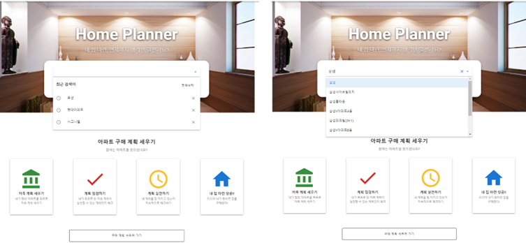

### 다양한 필터

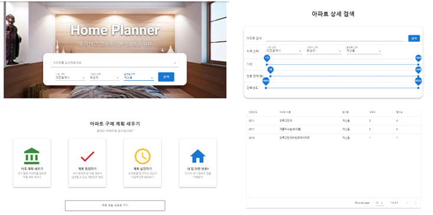

### 검색 결과

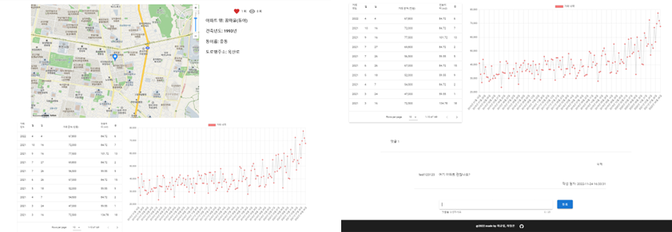

<br/>

## 유저 간의 정보 공유

### 게시판, 아파트 댓글

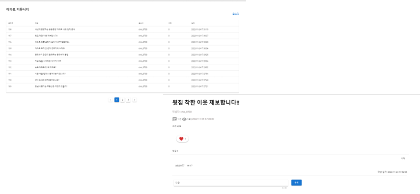

<br/>

## 경로 찾기

### 거리순, 시간순, 경로 리스트 소요 시간, 거리

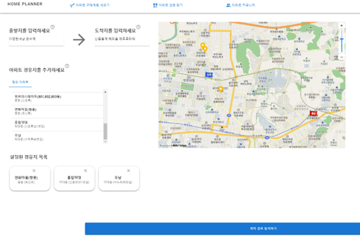

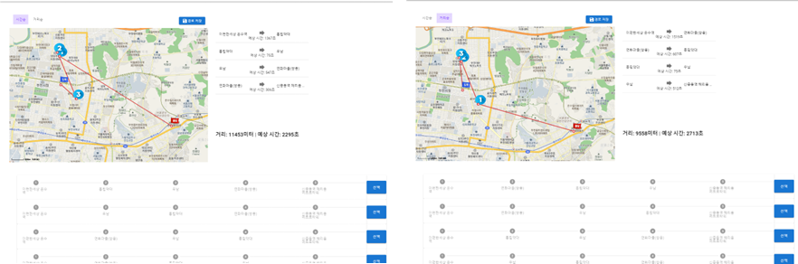

<br/>

## 구매 계획 세우기

### 구매 희망 아파트 매물, 구매 가능 시기 계산


<br/>

## 즐겨찾기

### 아파트 매물, 경로, 구매 계획 즐겨찾기

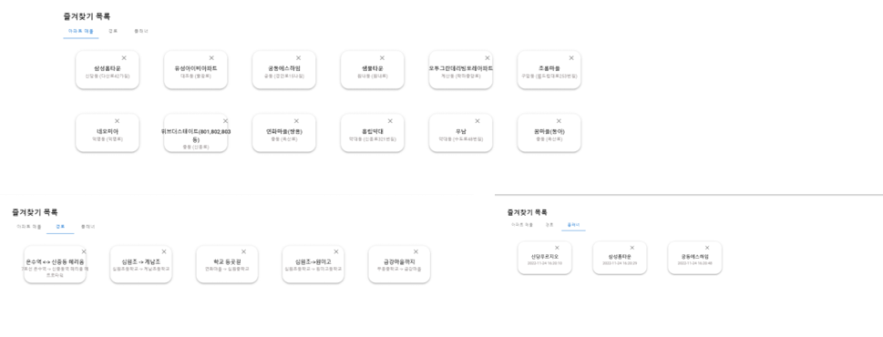

<br/>

# 🎁 기대효과

- 검색 편의성 제공

  - 검색 자동완성 기능과 최근 검색, 아파트 상세 검색(아파트 이름, 지역, 가격, 전용 면적, 건축년도)등을 통해 사용자에게 최대한 편리하면서도 자세한 검색 결과를 제공하려고 노력하였다.

- 정보 공유

  - 커뮤니티 게시판과 아파트별 댓글 기능을 통해 HomePlanner 서비스를 이용하는 사용자간의 커뮤니케이션을 극대화하려고 하였다.

- 아파트 경로 찾기

  - kakao 모빌리티 길찾기 API와 수업시간에 배운 순열을 바탕으로 직접 구현한 아파트 경로 찾기 알고리즘을 통해 아파트 여러군데를 최저시간으로 둘러보고 싶은 사용자를 위한 기능을 개발하였다.

- 아파트 구매 계획 세우기
  - 원하는 아파트를 찾고 난 후 실제로 사용자의 행동을 유도하기 위해 구매 계획 기능을 제공하여 저축액에 따른 예상 아파트 구매 년도를 알려줍니다.

<br/>

# 🏠 산출물

## 화면구조도

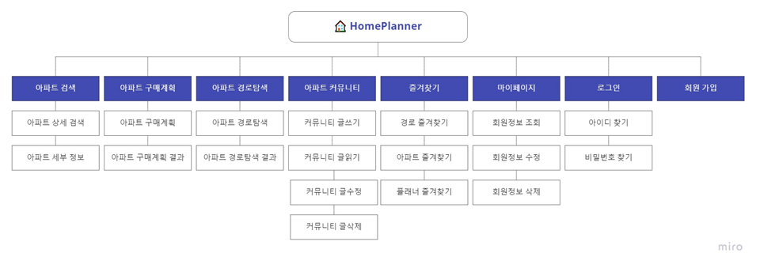

## 아키텍처

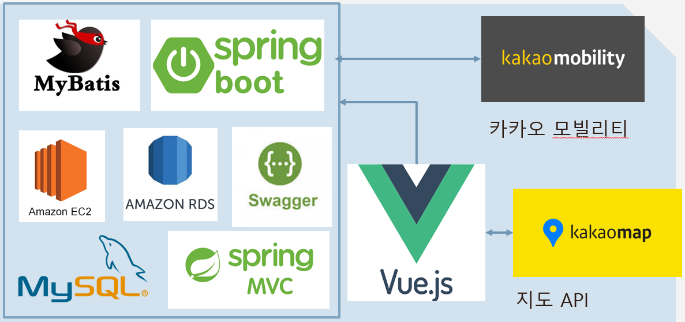

## ERD


## UseCase Diagram

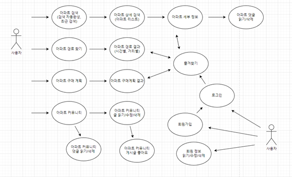

## Class Diagram

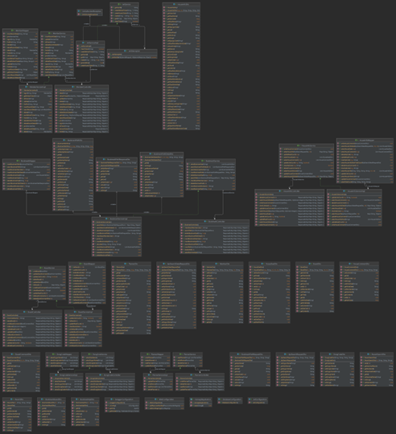

## 비밀번호 암호화(hash256 + Salt)

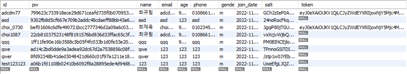

## Git Convention

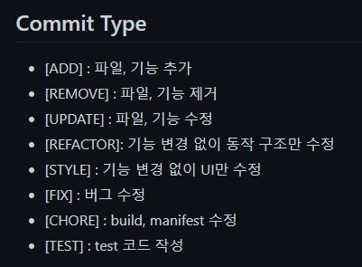

## 기능명세서

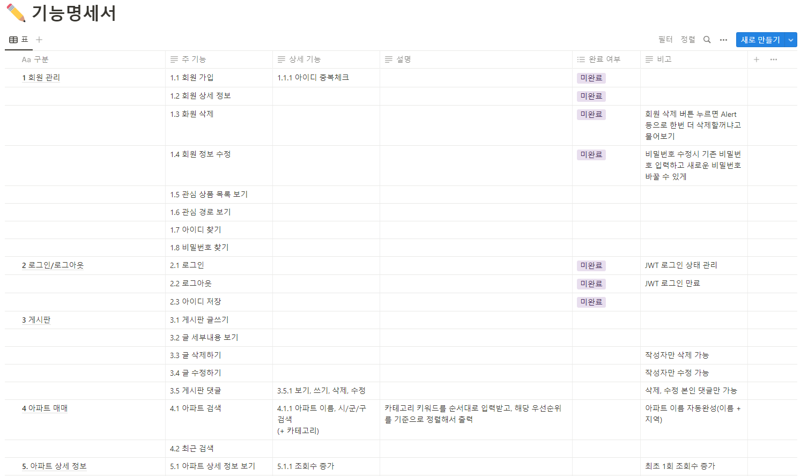

## API명세서

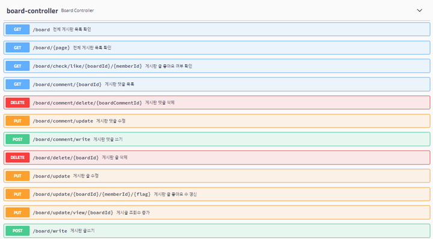
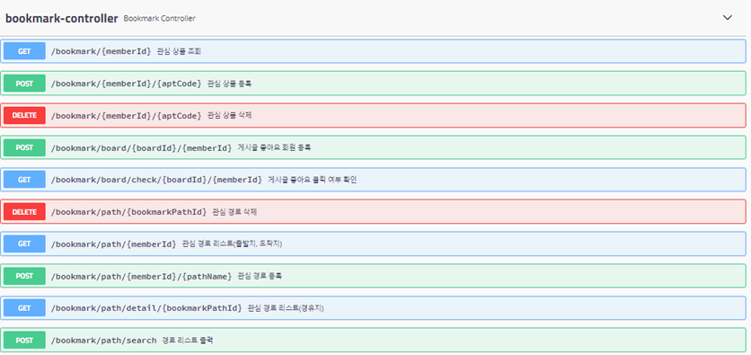
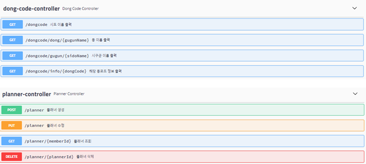

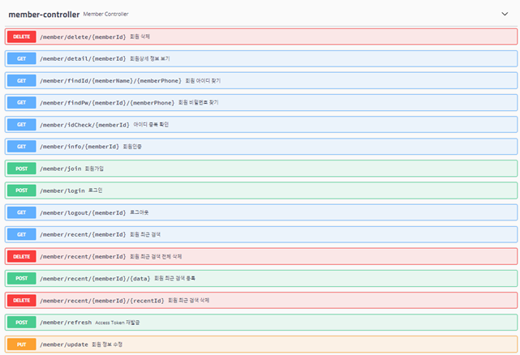

# 📁 프로젝트 구조

## 🏠 Backend

```java
📦back-end
 ┣ 📂.mvn
 ┃ ┗ 📂wrapper
 ┃ ┃ ┣ 📜maven-wrapper.jar
 ┃ ┃ ┗ 📜maven-wrapper.properties
 ┣ 📂src
 ┃ ┣ 📂main
 ┃ ┃ ┣ 📂java
 ┃ ┃ ┃ ┗ 📂com
 ┃ ┃ ┃ ┃ ┗ 📂ssafy
 ┃ ┃ ┃ ┃ ┃ ┗ 📂homepjt
 ┃ ┃ ┃ ┃ ┃ ┃ ┣ 📂config
 ┃ ┃ ┃ ┃ ┃ ┃ ┃ ┣ 📜DatabaseConfiguration.java
 ┃ ┃ ┃ ┃ ┃ ┃ ┃ ┣ 📜JwtConfiguration.java
 ┃ ┃ ┃ ┃ ┃ ┃ ┃ ┣ 📜SwaggerConfiguration.java
 ┃ ┃ ┃ ┃ ┃ ┃ ┃ ┗ 📜WebConfiguration.java
 ┃ ┃ ┃ ┃ ┃ ┃ ┣ 📂controller
 ┃ ┃ ┃ ┃ ┃ ┃ ┃ ┣ 📜BoardController.java
 ┃ ┃ ┃ ┃ ┃ ┃ ┃ ┣ 📜BookmarkController.java
 ┃ ┃ ┃ ┃ ┃ ┃ ┃ ┣ 📜DongCodeController.java
 ┃ ┃ ┃ ┃ ┃ ┃ ┃ ┣ 📜HouseInfoController.java
 ┃ ┃ ┃ ┃ ┃ ┃ ┃ ┣ 📜MemberController.java
 ┃ ┃ ┃ ┃ ┃ ┃ ┃ ┗ 📜PlannerController.java
 ┃ ┃ ┃ ┃ ┃ ┃ ┣ 📂exception
 ┃ ┃ ┃ ┃ ┃ ┃ ┃ ┗ 📜UnAuthorizedException.java
 ┃ ┃ ┃ ┃ ┃ ┃ ┣ 📂interceptor
 ┃ ┃ ┃ ┃ ┃ ┃ ┃ ┗ 📜JwtInterceptor.java
 ┃ ┃ ┃ ┃ ┃ ┃ ┣ 📂model
 ┃ ┃ ┃ ┃ ┃ ┃ ┃ ┣ 📂dto
 ┃ ┃ ┃ ┃ ┃ ┃ ┃ ┃ ┣ 📜BoardCommentDto.java
 ┃ ┃ ┃ ┃ ┃ ┃ ┃ ┃ ┣ 📜BoardDto.java
 ┃ ┃ ┃ ┃ ┃ ┃ ┃ ┃ ┣ 📜BookmarkAptDto.java
 ┃ ┃ ┃ ┃ ┃ ┃ ┃ ┃ ┣ 📜BookmarkBoardDto.java
 ┃ ┃ ┃ ┃ ┃ ┃ ┃ ┃ ┣ 📜BookmarkPathDetailDto.java
 ┃ ┃ ┃ ┃ ┃ ┃ ┃ ┃ ┣ 📜BookmarkPathDto.java
 ┃ ┃ ┃ ┃ ┃ ┃ ┃ ┃ ┣ 📜DongCodeDto.java
 ┃ ┃ ┃ ┃ ┃ ┃ ┃ ┃ ┣ 📜HouseCommentDto.java
 ┃ ┃ ┃ ┃ ┃ ┃ ┃ ┃ ┣ 📜HouseDealDto.java
 ┃ ┃ ┃ ┃ ┃ ┃ ┃ ┃ ┣ 📜HouseInfoDto.java
 ┃ ┃ ┃ ┃ ┃ ┃ ┃ ┃ ┣ 📜MemberDto.java
 ┃ ┃ ┃ ┃ ┃ ┃ ┃ ┃ ┣ 📜PlannerDto.java
 ┃ ┃ ┃ ┃ ┃ ┃ ┃ ┃ ┣ 📜RecentDto.java
 ┃ ┃ ┃ ┃ ┃ ┃ ┃ ┃ ┗ 📜RecentSearchDto.java
 ┃ ┃ ┃ ┃ ┃ ┃ ┃ ┣ 📂mapper
 ┃ ┃ ┃ ┃ ┃ ┃ ┃ ┃ ┣ 📜BoardMapper.java
 ┃ ┃ ┃ ┃ ┃ ┃ ┃ ┃ ┣ 📜BookmarkMapper.java
 ┃ ┃ ┃ ┃ ┃ ┃ ┃ ┃ ┣ 📜DongCodeMapper.java
 ┃ ┃ ┃ ┃ ┃ ┃ ┃ ┃ ┣ 📜HouseInfoMapper.java
 ┃ ┃ ┃ ┃ ┃ ┃ ┃ ┃ ┣ 📜MemberMapper.java
 ┃ ┃ ┃ ┃ ┃ ┃ ┃ ┃ ┗ 📜PlannerMapper.java
 ┃ ┃ ┃ ┃ ┃ ┃ ┃ ┣ 📂request
 ┃ ┃ ┃ ┃ ┃ ┃ ┃ ┃ ┣ 📜AptSearchDetailRequestDto.java
 ┃ ┃ ┃ ┃ ┃ ┃ ┃ ┃ ┣ 📜AptSearchRequestDto.java
 ┃ ┃ ┃ ┃ ┃ ┃ ┃ ┃ ┗ 📜BookmarkPathRequestDto.java
 ┃ ┃ ┃ ┃ ┃ ┃ ┃ ┣ 📂response
 ┃ ┃ ┃ ┃ ┃ ┃ ┃ ┃ ┗ 📜BookmarkPathResponseDto.java
 ┃ ┃ ┃ ┃ ┃ ┃ ┃ ┗ 📂service
 ┃ ┃ ┃ ┃ ┃ ┃ ┃ ┃ ┣ 📜BoardService.java
 ┃ ┃ ┃ ┃ ┃ ┃ ┃ ┃ ┣ 📜BoardServiceImpl.java
 ┃ ┃ ┃ ┃ ┃ ┃ ┃ ┃ ┣ 📜BookmarkService.java
 ┃ ┃ ┃ ┃ ┃ ┃ ┃ ┃ ┣ 📜BookmarkServiceImpl.java
 ┃ ┃ ┃ ┃ ┃ ┃ ┃ ┃ ┣ 📜DongCodeService.java
 ┃ ┃ ┃ ┃ ┃ ┃ ┃ ┃ ┣ 📜DongCodeServiceImpl.java
 ┃ ┃ ┃ ┃ ┃ ┃ ┃ ┃ ┣ 📜HouseInfoService.java
 ┃ ┃ ┃ ┃ ┃ ┃ ┃ ┃ ┣ 📜HouseInfoServiceImpl.java
 ┃ ┃ ┃ ┃ ┃ ┃ ┃ ┃ ┣ 📜JwtService.java
 ┃ ┃ ┃ ┃ ┃ ┃ ┃ ┃ ┣ 📜JwtServiceImpl.java
 ┃ ┃ ┃ ┃ ┃ ┃ ┃ ┃ ┣ 📜MemberService.java
 ┃ ┃ ┃ ┃ ┃ ┃ ┃ ┃ ┣ 📜MemberServiceImpl.java
 ┃ ┃ ┃ ┃ ┃ ┃ ┃ ┃ ┣ 📜PlannerService.java
 ┃ ┃ ┃ ┃ ┃ ┃ ┃ ┃ ┗ 📜PlannerServiceImpl.java
 ┃ ┃ ┃ ┃ ┃ ┃ ┗ 📜HomepjtApplication.java
 ┃ ┃ ┗ 📂resources
 ┃ ┃ ┃ ┣ 📂mappers
 ┃ ┃ ┃ ┃ ┣ 📜board.xml
 ┃ ┃ ┃ ┃ ┣ 📜bookmark.xml
 ┃ ┃ ┃ ┃ ┣ 📜dongcode.xml
 ┃ ┃ ┃ ┃ ┣ 📜houseinfo.xml
 ┃ ┃ ┃ ┃ ┣ 📜member.xml
 ┃ ┃ ┃ ┃ ┗ 📜planner.xml
 ┃ ┃ ┃ ┣ 📜application.properties
 ┃ ┃ ┃ ┗ 📜log4jdbc.log4j2.properties
 ┃ ┗ 📂test
 ┃ ┃ ┗ 📂java
 ┃ ┃ ┃ ┗ 📂com
 ┃ ┃ ┃ ┃ ┗ 📂ssafy
 ┃ ┃ ┃ ┃ ┃ ┗ 📂homepjt
 ┃ ┃ ┃ ┃ ┃ ┃ ┗ 📜HomepjtApplicationTests.java
 ┣ 📜.gitignore
 ┣ 📜mvnw
 ┣ 📜mvnw.cmd
 ┗ 📜pom.xml
```

## 🏠 Frontend

```java
📦front-end
 ┣ 📂homepjt
 ┃ ┣ 📂public
 ┃ ┃ ┣ 📜favicon.ico
 ┃ ┃ ┗ 📜index.html
 ┃ ┣ 📂src
 ┃ ┃ ┣ 📂api
 ┃ ┃ ┃ ┣ 📜apt.js
 ┃ ┃ ┃ ┣ 📜board.js
 ┃ ┃ ┃ ┣ 📜bookmark.js
 ┃ ┃ ┃ ┣ 📜houseInfo.js
 ┃ ┃ ┃ ┣ 📜http.js
 ┃ ┃ ┃ ┣ 📜index.js
 ┃ ┃ ┃ ┣ 📜member.js
 ┃ ┃ ┃ ┗ 📜planner.js
 ┃ ┃ ┣ 📂assets
 ┃ ┃ ┃ ┣ 📜backgroundImage.jpg
 ┃ ┃ ┃ ┣ 📜logo.png
 ┃ ┃ ┃ ┣ 📜logo.svg
 ┃ ┃ ┃ ┣ 📜logo123.png
 ┃ ┃ ┃ ┣ 📜number-five.png
 ┃ ┃ ┃ ┣ 📜number-four.png
 ┃ ┃ ┃ ┣ 📜number-one.png
 ┃ ┃ ┃ ┣ 📜number-three.png
 ┃ ┃ ┃ ┣ 📜number-two.png
 ┃ ┃ ┃ ┗ 📜ssafy_logo.png
 ┃ ┃ ┣ 📂components
 ┃ ┃ ┃ ┣ 📂apt
 ┃ ┃ ┃ ┃ ┣ 📜AptCommentItem.vue
 ┃ ┃ ┃ ┃ ┗ 📜AptSearchTab.vue
 ┃ ┃ ┃ ┣ 📂board
 ┃ ┃ ┃ ┃ ┣ 📂item
 ┃ ┃ ┃ ┃ ┃ ┣ 📜BoardCommentItem.vue
 ┃ ┃ ┃ ┃ ┃ ┣ 📜BoardInputItem.vue
 ┃ ┃ ┃ ┃ ┃ ┗ 📜BoardUpdateItem.vue
 ┃ ┃ ┃ ┃ ┣ 📜BoardDetail.vue
 ┃ ┃ ┃ ┃ ┣ 📜BoardList.vue
 ┃ ┃ ┃ ┃ ┣ 📜BoardUpdate.vue
 ┃ ┃ ┃ ┃ ┗ 📜BoardWrite.vue
 ┃ ┃ ┃ ┣ 📂chart
 ┃ ┃ ┃ ┃ ┗ 📜LineChart.vue
 ┃ ┃ ┃ ┣ 📂planner
 ┃ ┃ ┃ ┃ ┗ 📜PlannerResult.vue
 ┃ ┃ ┃ ┣ 📜FooterNav.vue
 ┃ ┃ ┃ ┗ 📜HeaderNav.vue
 ┃ ┃ ┣ 📂plugins
 ┃ ┃ ┃ ┗ 📜vuetify.js
 ┃ ┃ ┣ 📂router
 ┃ ┃ ┃ ┗ 📜index.js
 ┃ ┃ ┣ 📂store
 ┃ ┃ ┃ ┣ 📂modules
 ┃ ┃ ┃ ┃ ┣ 📜aptStore.js
 ┃ ┃ ┃ ┃ ┣ 📜boardStore.js
 ┃ ┃ ┃ ┃ ┣ 📜bookmarkStore.js
 ┃ ┃ ┃ ┃ ┣ 📜houseInfoStore.js
 ┃ ┃ ┃ ┃ ┣ 📜memberStore.js
 ┃ ┃ ┃ ┃ ┗ 📜plannerStore.js
 ┃ ┃ ┃ ┗ 📜index.js
 ┃ ┃ ┣ 📂views
 ┃ ┃ ┃ ┣ 📂apt
 ┃ ┃ ┃ ┃ ┣ 📜AptListView.vue
 ┃ ┃ ┃ ┃ ┗ 📜AptResultView.vue
 ┃ ┃ ┃ ┣ 📂board
 ┃ ┃ ┃ ┃ ┗ 📜BoardView.vue
 ┃ ┃ ┃ ┣ 📂bookmark
 ┃ ┃ ┃ ┃ ┗ 📜BookmarkView.vue
 ┃ ┃ ┃ ┣ 📂member
 ┃ ┃ ┃ ┃ ┣ 📜IdSearchView.vue
 ┃ ┃ ┃ ┃ ┣ 📜LogInView.vue
 ┃ ┃ ┃ ┃ ┣ 📜MyPageView.vue
 ┃ ┃ ┃ ┃ ┣ 📜PasswordSearchView.vue
 ┃ ┃ ┃ ┃ ┣ 📜SignUpView.vue
 ┃ ┃ ┃ ┃ ┗ 📜UpdateMemberInfoView.vue
 ┃ ┃ ┃ ┣ 📂path
 ┃ ┃ ┃ ┃ ┣ 📜PathResultView.vue
 ┃ ┃ ┃ ┃ ┗ 📜PathView.vue
 ┃ ┃ ┃ ┣ 📂planner
 ┃ ┃ ┃ ┃ ┣ 📜PlannerResultView.vue
 ┃ ┃ ┃ ┃ ┗ 📜PlannerView.vue
 ┃ ┃ ┃ ┗ 📜HomeView.vue
 ┃ ┃ ┣ 📜App.vue
 ┃ ┃ ┗ 📜main.js
 ┃ ┣ 📜.browserslistrc
 ┃ ┣ 📜.eslintrc.js
 ┃ ┣ 📜.gitignore
 ┃ ┣ 📜babel.config.js
 ┃ ┣ 📜jsconfig.json
 ┃ ┣ 📜package-lock.json
 ┃ ┣ 📜package.json
 ┃ ┣ 📜README.md
 ┃ ┗ 📜vue.config.js
 ┗ 📜package-lock.json
```

# 🏠 소감

<<<<<<< HEAD

=======

> > > > > > > 4a4031e0bd925fccc6c73341b4666216bf1bcc2c
> > > > > > > 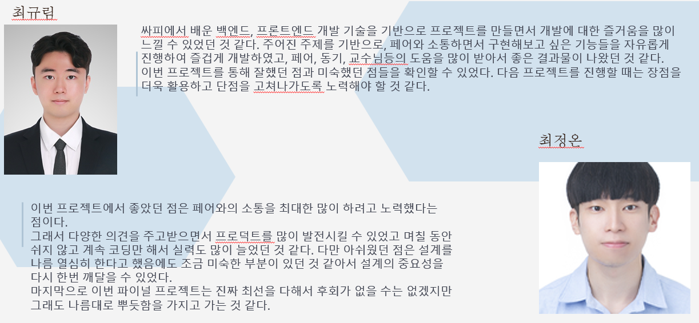
