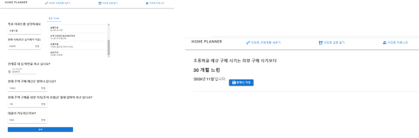

# 🏠 HomePlanner
아파트를 찾고 구매 계획을 세워주는 HomePlanner 서비스 입니다.


## 🎥 [소개 영상 보기 : UCC 링크](https://youtu.be/UyOa3QpjnwQ)

<br/>


# 🏠 **프로젝트 일정**

### 📅 **2022-11-16(수) ~ 2023-11-25(금) (1주)**

<br/>

# 🏠 기술 스택

## 플랫폼

Web

## 개발 인원

2명

## 언어

HTML, CSS, JavaScript, Java(JDK 1.8), SQL

## 서버

Apache Tomcat 2.7.5(Embeded)

## 프레임워크

VueJs 2.7.14 , Spring Boot 2.7.5, MyBatis 2.2.2, Vuetify

## DB

MYSQL 8.0.28

## IDE

VSCode, STS, IntelliJ, MySQL workbench

## API

kakao Maps, kakao mobility, kakao 우편번호

<br/>

# 🏠 HomePlanner 기능

## 검색 편의성 제공
### 검색어 자동완성, 최근 검색어


### 다양한 필터


### 검색 결과


<br/>

## 유저 간의 정보 공유 
### 게시판, 아파트 댓글


<br/>

## 경로 찾기
### 거리순, 시간순, 경로 리스트 소요 시간, 거리


<br/>

## 구매 계획 세우기
### 구매 희망 아파트 매물, 구매 가능 시기 계산



<br/>

## 즐겨찾기
### 아파트 매물, 경로, 구매 계획 즐겨찾기


<br/>

# 🎁 기대효과

- 검색 편의성 제공
    - 검색 자동완성 기능과 최근 검색, 아파트 상세 검색(아파트 이름, 지역, 가격, 전용 면적, 건축년도)등을 통해 사용자에게 최대한 편리하면서도 자세한 검색 결과를 제공하려고 노력하였다.

- 정보 공유 
    - 커뮤니티 게시판과 아파트별 댓글 기능을 통해 HomePlanner 서비스를 이용하는 사용자간의 커뮤니케이션을 극대화하려고 하였다.

- 아파트 경로 찾기
    - kakao 모빌리티 길찾기 API와 수업시간에 배운 순열을 바탕으로 직접 구현한 아파트 경로 찾기 알고리즘을 통해 아파트 여러군데를 최저시간으로 둘러보고 싶은 사용자를 위한 기능을 개발하였다.

- 아파트 구매 계획 세우기
    - 원하는 아파트를 찾고 난 후 실제로 사용자의 행동을 유도하기 위해 구매 계획 기능을 제공하여 저축액에 따른 예상 아파트 구매 년도를 알려줍니다.

<br/>

# 🏠 산출물
## 화면구조도


## 아키텍처


## ERD


## UseCase Diagram


## Class Diagram


## 비밀번호 암호화(hash256 + Salt)


## Git Convention


## 기능명세서


## API명세서


# 📁 프로젝트 구조

## 🏠 Backend


```java

```

## 🏠 Frontend

```java
homepjt
 ┣ public
 ┃ ┣ favicon.ico
 ┃ ┗ index.html
 ┣ src
 ┃ ┣ api
 ┃ ┃ ┣ apt.js
 ┃ ┃ ┣ board.js
 ┃ ┃ ┣ bookmark.js
 ┃ ┃ ┣ houseInfo.js
 ┃ ┃ ┣ http.js
 ┃ ┃ ┣ index.js
 ┃ ┃ ┣ member.js
 ┃ ┃ ┗ planner.js
 ┃ ┣ assets
 ┃ ┃ ┣ backgroundImage.jpg
 ┃ ┃ ┣ logo.png
 ┃ ┃ ┣ logo.svg
 ┃ ┃ ┣ logo123.png
 ┃ ┃ ┣ number-five.png
 ┃ ┃ ┣ number-four.png
 ┃ ┃ ┣ number-one.png
 ┃ ┃ ┣ number-three.png
 ┃ ┃ ┣ number-two.png
 ┃ ┃ ┗ ssafy_logo.png
 ┃ ┣ components
 ┃ ┃ ┣ apt
 ┃ ┃ ┃ ┣ AptCommentItem.vue
 ┃ ┃ ┃ ┗ AptSearchTab.vue
 ┃ ┃ ┣ board
 ┃ ┃ ┃ ┣ item
 ┃ ┃ ┃ ┃ ┣ BoardCommentItem.vue
 ┃ ┃ ┃ ┃ ┣ BoardInputItem.vue
 ┃ ┃ ┃ ┃ ┗ BoardUpdateItem.vue
 ┃ ┃ ┃ ┣ BoardDetail.vue
 ┃ ┃ ┃ ┣ BoardList.vue
 ┃ ┃ ┃ ┣ BoardUpdate.vue
 ┃ ┃ ┃ ┗ BoardWrite.vue
 ┃ ┃ ┣ chart
 ┃ ┃ ┃ ┗ LineChart.vue
 ┃ ┃ ┣ planner
 ┃ ┃ ┃ ┗ PlannerResult.vue
 ┃ ┃ ┣ FooterNav.vue
 ┃ ┃ ┗ HeaderNav.vue
 ┃ ┣ plugins
 ┃ ┃ ┗ vuetify.js
 ┃ ┣ router
 ┃ ┃ ┗ index.js
 ┃ ┣ store
 ┃ ┃ ┣ modules
 ┃ ┃ ┃ ┣ aptStore.js
 ┃ ┃ ┃ ┣ boardStore.js
 ┃ ┃ ┃ ┣ bookmarkStore.js
 ┃ ┃ ┃ ┣ houseInfoStore.js
 ┃ ┃ ┃ ┣ memberStore.js
 ┃ ┃ ┃ ┗ plannerStore.js
 ┃ ┃ ┗ index.js
 ┃ ┣ views
 ┃ ┃ ┣ apt
 ┃ ┃ ┃ ┣ AptListView.vue
 ┃ ┃ ┃ ┗ AptResultView.vue
 ┃ ┃ ┣ board
 ┃ ┃ ┃ ┗ BoardView.vue
 ┃ ┃ ┣ bookmark
 ┃ ┃ ┃ ┗ BookmarkView.vue
 ┃ ┃ ┣ member
 ┃ ┃ ┃ ┣ IdSearchView.vue
 ┃ ┃ ┃ ┣ LogInView.vue
 ┃ ┃ ┃ ┣ MyPageView.vue
 ┃ ┃ ┃ ┣ PasswordSearchView.vue
 ┃ ┃ ┃ ┣ SignUpView.vue
 ┃ ┃ ┃ ┗ UpdateMemberInfoView.vue
 ┃ ┃ ┣ path
 ┃ ┃ ┃ ┣ PathResultView.vue
 ┃ ┃ ┃ ┗ PathView.vue
 ┃ ┃ ┣ planner
 ┃ ┃ ┃ ┣ PlannerResultView.vue
 ┃ ┃ ┃ ┗ PlannerView.vue
 ┃ ┃ ┗ HomeView.vue
 ┃ ┣ App.vue
 ┃ ┗ main.js
 ┣ .browserslistrc
 ┣ .eslintrc.js
 ┣ .gitignore
 ┣ babel.config.js
 ┣ jsconfig.json
 ┣ package-lock.json
 ┣ package.json
 ┣ README.md
 ┗ vue.config.js
```

# 🏠 소감

